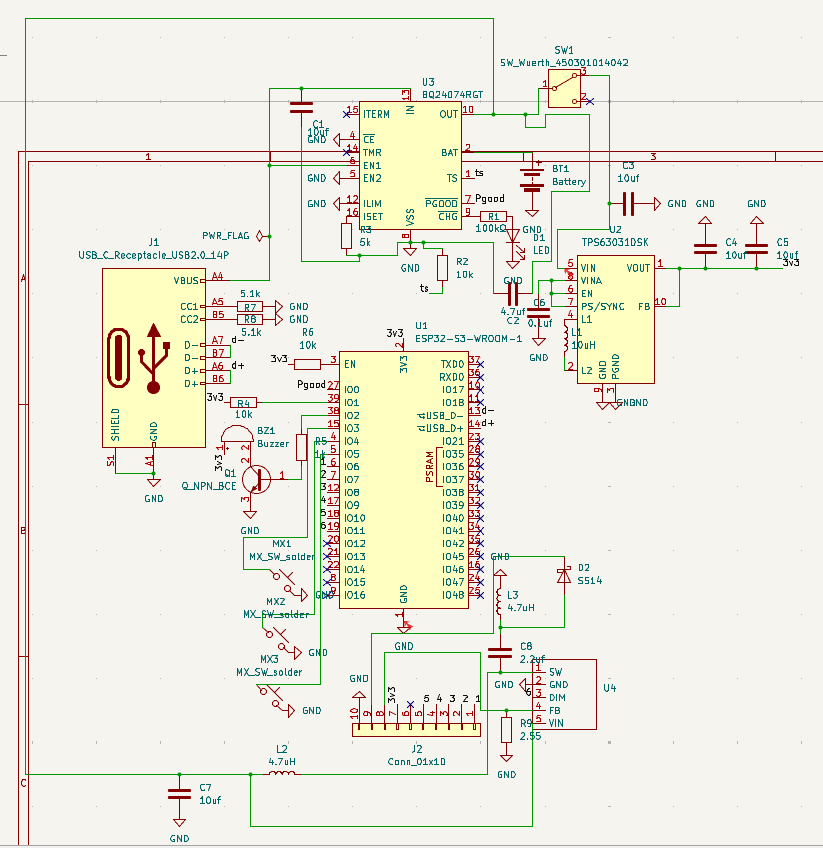

# August 31: Designed the schematic

Spent the afternoon making the schematic and wiring it all up. Ran into a few issues, such as there not being a symbol for the LED backlight driver so I had to make a symbol from scratch which I had not done before.

**Total time spent: 5 hours**

# September 1: Started the PCB design

I started the PCB layout and finished the board after a while. It took me a while to figure out how to lay out all the components, as I kept having issues with routing them. 

**Total time spent: 5 hours**
